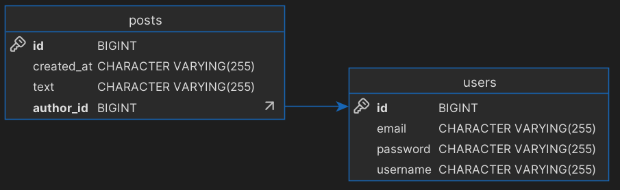

# Tiny blog with GraphQL

A tiny project demonstrating working with GraphQL with the Spring framework. You can find examples of queries in the file [graphql-examples.md](./graphql-examples.md).

### How to run

1. Clone this repository and move to the root dir
2. Run `docker-compose up` to create a container with PostgreSQL database
3. Run the application
4. Open `http://localhost:8080/graphiql` in your browser to test the API
5. Try some queries and mutations from [graphql-examples.md](./graphql-examples.md)

### Database schema

